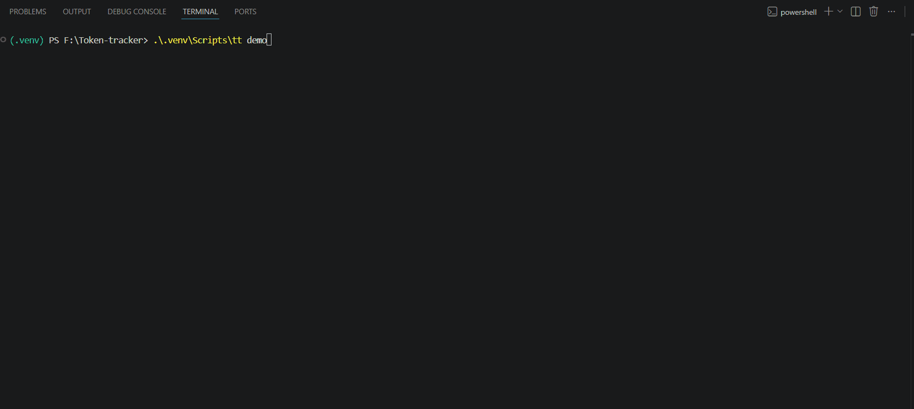

# Token Tracker

> **Gas optimization for LLM prompts.** A pre-flight analyzer + usage tracker for the Claude API. Catches vague, wasteful, or open-ended prompts *before* they hit the wire — and suggests a leaner rewrite.

[](https://pypi.org/project/promptmeter/)
[](https://pypi.org/project/promptmeter/)
[](LICENSE)
[](https://github.com/emam07/Token-tracker/actions)

---

## The idea

Solidity devs use a gas estimator before deploying. LLM devs send blind prompts and wait for the bill.

Token Tracker fixes that. It wraps the Anthropic SDK and adds three layers:

| Layer | What it does | Analogy |
|---|---|---|
| **Token Tracker** | Logs every API call — tokens in/out, cost, session | Gas meter |
| **Pre-flight Analyzer** | Scores your prompt before sending — flags 8 patterns of waste | Gas estimator + linter |
| **Prompt Optimizer** | Rewrites bad prompts into leaner versions, side-by-side | Compiler optimizer |

All analysis is **offline** — zero extra API calls. Storage is local SQLite.

---

## Demo



*Run `tt demo` yourself to see all features without using any API credits.*

---

## Quickstart

```bash
pip install promptmeter
export ANTHROPIC_API_KEY="sk-ant-..."
```

### As a drop-in for the Anthropic SDK

```python
from token_tracker import TrackedClient

client = TrackedClient(session_name="my-app")

response = client.messages.create(
    model="claude-sonnet-4-6",
    max_tokens=512,
    messages=[{"role": "user", "content": "List 3 Python web frameworks."}],
)
```

That's it. Every call is now analyzed, logged, and reportable.

### As a standalone CLI

```bash
tt analyze "Please could you kindly tell me something about Python"
tt report                # today's usage summary
tt report --week         # last 7 days
tt cost-model            # cost breakdown by model
tt top-waste             # most expensive flagged prompts
tt sessions              # list named sessions
tt demo                  # guided walkthrough — zero API calls
```

---

## What the pre-flight catches

8 rules, each with severity and a suggested fix:

| Rule | Severity | Detects |
|---|---|---|
| `VAGUE_INTENT` | high | `"tell me something about X"` — no clear task |
| `OPEN_ENDED_TASK` | high | `"explain everything about X"` — unbounded scope |
| `WALL_OF_TEXT` | high | unstructured 500+ token dumps |
| `MISSING_FORMAT` | medium | asks for a list without specifying format |
| `MISSING_SCOPE` | medium | `"explain X"` with no length/depth limit |
| `REDUNDANT_CONTEXT` | medium | the same sentence twice |
| `FILLER_WORDS` | low | "please", "could you kindly", "thank you in advance" |
| `AMBIGUOUS_PRONOUN` | low | "fix it" — fix what? |

Each rule contributes to a **0–100 efficiency score**. Below 60 triggers a warning. Below 40 hard-blocks (in interactive mode).

---

## Try the walkthrough

```bash
tt demo
```

Runs through every feature with three example prompts (good, bad, terrible) and renders the live dashboard. No API calls, safe to run anytime.

---

## How it actually saves tokens

| Without Token Tracker | With Token Tracker |
|---|---|
| Vague prompt → Claude asks clarifying questions → 2-3 round trips | Pre-flight catches vagueness → fix once → one round trip |
| `"explain X"` → Claude writes 800 words when you needed 100 | `MISSING_SCOPE` flags it → add `"in 3 sentences"` → 6× cheaper output |
| Same context pasted in every message | `REDUNDANT_CONTEXT` warns → use prompt caching → 90% cheaper input |
| No visibility into spend → no behavior change | Daily report shows cost per session → habits adjust |

Conservative real-world reduction: **30–50% of token spend** for a developer who acts on warnings.

---

## Configuration

```python
TrackedClient(
    api_key="sk-ant-...",
    session_name="my-app",      # tag this session in the DB
    analyze=True,               # run pre-flight before every call
    interactive=True,           # prompt user on flagged prompts (s/o/c menu)
    warn_threshold=60,          # show warning when score drops below this
)
```

---

## Where data lives

A single SQLite file at `~/.token_tracker/usage.db`. Two tables: `sessions`, `usage_records`. Open it with [DB Browser for SQLite](https://sqlitebrowser.org/) to poke around.

Token Tracker stores a hash of each prompt — never the full text. Your prompts stay in your process.

---

## Contributing

The lowest-friction first contribution is **adding a new rule** in `token_tracker/analyzer/rules.py` — about 10 lines of Python. See [CONTRIBUTING.md](CONTRIBUTING.md).

Found a false positive? Open an issue with the prompt and the rule that misfired.

---

## License

MIT — see [LICENSE](LICENSE).
